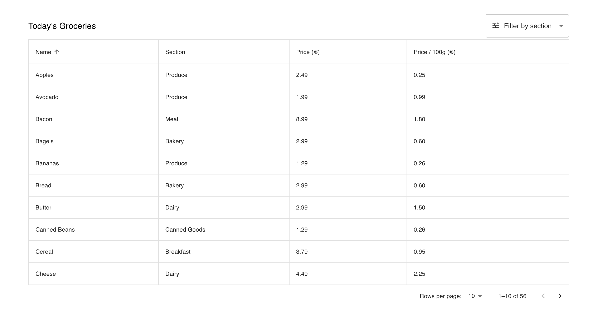
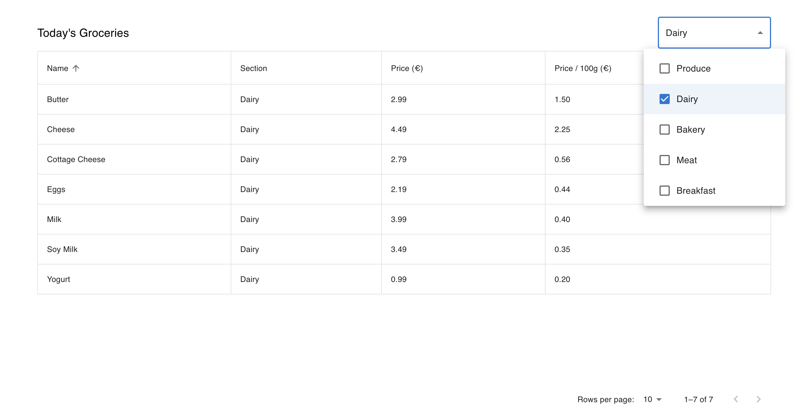

## Coolset - Table UI Challenge

### Requirements:

1. [x] Pagination.
2. [x] Row display: users should be able to choose how many rows are displayed on a single page.
3. [x] Sorting: users should be able to sort the table on at least one field.
4. [x] Filtering: users should be able to filter the table based on the values in the section column.

### Nice To Haves:

1. [x] Sticky Headers
2. [x] Accessibility (Lighthouse score: 90)
3. [x] Responsive. (Improvements to be made)

#### [View the deployed application here.](https://main--coolset-table.netlify.app/)

#### [Click here to see the Video Review]([LINK_TO_LOOM_VIDEO])

## Solutions / Considerations

- With "Time To Market" a factor, I chose to bootstrap the table using Material UI, allowing for speed and greater accessibility out of the box.
- With SOLID principles in mind, I endeavoured to make the UI components reusable and strongly typed, using Typescript Generics where appropriate,
- I implemented a REST like structure for a mock API Response using query params to only return the records that satisfy the criteria.
- Minimised CLS by rendering a skeleton during loading.
- Created a generic useFetchData hook that could be used elsewhere in the application.

## Screenshots

## Libraries / Tools Used

- React.js
- Create React App (for project setup)
- Typescript
- MaterialUI
- React Skeleton

## Setup

To install the dependencies run:

`npm install`

And to run the app:

`npm start`

## Future Work

1. Add Unit and Integrations tests:
   - Behavioural Component Tests.
   - Helper function tests.
2. Improve styling and responsive design
   - MaterialUI has been used for speed but is limited in it's flexibility.
   - A closer representation of the design can be achieved with more time.
   - Although the table is scrollable for mobile, a more robust solution whereby table rows contents is stacked vertically could be implemented.
3. Typeguard incoming data.
4. Minimise CLS:
   - Fine Tune Loading placeholders to eliminate CLS (dynamically inserting correct number of rows when changing page for example).
5. Add a more robust state management solution.
6. Improve the Filters UI (Selected filters to be added as separate buttons in the toolbar).
